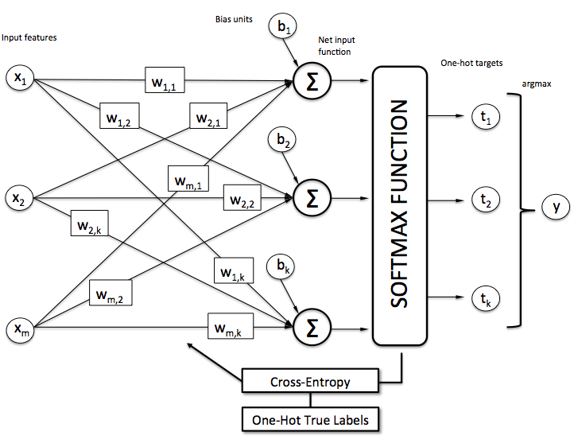

# Softmax Regression for MNIST Dataset

## Introduction

This repository contains an implementation of Softmax Regression for the MNIST dataset, a classic benchmark for handwritten digit classification. Softmax Regression is a generalized linear model for multiclass classification problems. In this implementation, we use NumPy to perform all necessary computations.

## Explanation

### Softmax Regression

Softmax Regression (or Multinomial Logistic Regression) is used for multiclass classification. It estimates the probability distribution over multiple classes given the input features.

#### Softmax Function

The Softmax function converts logits (raw prediction values) into probabilities. It is defined as:

$$
P(y = k \mid \mathbf{x}; \mathbf{\theta}) = \frac{\exp(z_k - c)}{\sum_{j} \exp(z_j - c)}
$$

where:
- $\( z_k \)$ is the logit for class $\( k \)$
- The denominator sums over all possible classes $\( j \)$
- $\( c \)$ is a constant

#### Categorical Cross-Entropy Loss

The Categorical Cross-Entropy Loss function is defined as:

$$
\text{Loss} = -\frac{1}{m} \sum_{i=1}^m \sum_{c=1}^C y_{i,c} \log(\hat{y}_{i,c})
$$

where:
- $\( m \)$ is the number of samples in the batch
- $\( y_{i,c} \)$ is the one-hot encoded true label of sample $\( i \)$ for class $\( c \)$
- $\( \hat{y}_{i,c} \)$ is the predicted probability of sample $\( i \)$ for class $\( c \)$

#### Gradient of Categorical Cross-Entropy Loss

The gradient of the Categorical Cross-Entropy Loss with respect to the parameters $\( \theta \)$ is:

$$
\frac{\partial \text{Loss}}{\partial \theta} = \frac{1}{m} \sum_{i=1}^m (\hat{y}_i - y_i) \cdot \frac{\partial z_i}{\partial \theta}
$$

where:
- $\( \hat{y}_i \)$ is the vector of predicted probabilities for sample $\( i \)$
- $\( y_i \)$ is the one-hot encoded true label for sample $\( i \)$
- $\( \frac{\partial z_i}{\partial \theta} \)$ is the gradient of the output with respect to the parameters $\( \theta \)$

### Gradient Descent

Gradient Descent is used to minimize the loss function by iteratively updating model parameters. The update rule is:

$$
\theta := \theta - \alpha \cdot \nabla_\theta \text{Loss}
$$

where:
- $\( \alpha \)$ is the learning rate
- $\( \nabla_\theta \text{Loss} \)$ is the gradient of the loss function with respect to $\( \theta \)$

## Flow of Computation

1. **Compute logits**: $\( z = X \cdot \theta \)$
2. **Apply Softmax** to obtain class probabilities: $\( p = \text{softmax}(z) \)$
3. **Compute Cross-Entropy Loss**: $\( \text{Loss} = -\frac{1}{m} \sum_{i=1}^{m} \sum_{k=1}^{K} y_{i,k} \log(p_{i,k}) \)$
4. **Update parameters using Gradient Descent**: $\( \theta := \theta - \alpha \cdot \nabla_\theta \text{Loss} \)$

## Execution

### Training Results

The model was trained for 1000 iterations with the following loss values recorded at various checkpoints:
- Iteration 0: Loss = 1.5889
- Iteration 100: Loss = 0.3442
- Iteration 200: Loss = 0.3093
- Iteration 300: Loss = 0.2939
- Iteration 400: Loss = 0.2847
- Iteration 500: Loss = 0.2784
- Iteration 600: Loss = 0.2737
- Iteration 700: Loss = 0.2700
- Iteration 800: Loss = 0.2669
- Iteration 900: Loss = 0.2644

**Accuracy**: 91.89%

## References

- [MNIST Dataset](http://yann.lecun.com/exdb/mnist/)
- [Softmax Regression Explained](https://machinelearningcoban.com/2017/02/17/softmax/#-gioi-thieu)

Feel free to explore the code and modify it to suit your needs!
